# Resultados de ejecución — Plan de Pruebas ComproYa (Caso de Uso 1 y Caso de Uso 2)

> **Nota:** la versión que sigue al pie de la letra el formato de caso de prueba funcional del docente (Anexo 1 de "6. PRUEBAS DE SOFTWARE.pdf" — INFORMACIÓN GLOBAL, tabla de datos de entrada con columnas CAMPO/VALOR/TIPO ESCENARIO/RESPUESTA ESPERADA/COINCIDE/RESPUESTA DEL SISTEMA, Probador con firma) es **`Resultados_Pruebas_ComproYa.docx`**, en la raíz del repo. Este `.md` queda como referencia rápida en texto plano y para el historial de git; el `.docx` es el documento para entregar.

Documento de resultados de la ejecución real de los 28 casos definidos en `Plan_Pruebas_ComproYa.docx` (10 de ruta, 10 basados en estado, 5 de integración, 3 de sistema). Todas las pruebas de unidad e integración corrieron con Jest contra una base de datos Postgres de pruebas real (`comproya_test`), nunca contra mocks en memoria. Las tres pruebas de sistema corrieron con Playwright contra el frontend y el backend reales: CU-04-01 (Caso de Uso 1) contra la aplicación real sin pasarela de pago de por medio, y CU-09-01/CU-09-02 (Caso de Uso 2) además contra Stripe en modo de prueba (sandbox) real — sin simular la pasarela.

**Fecha de ejecución:** 2026-09-17 para los 26 casos originales (PR-01 a PR-09, PE-01 a PE-10, PI-01 a PI-05, CU-09-01, CU-09-02); 2026-09-22 para PR-10 y CU-04-01, agregados en una segunda ronda para completar la distribución que precisó el docente en clase (10 Ruta / 10 Estado / 3 Integración mínimo / 3 Sistema). **Versión de ejecución:** 1 para los 28 casos (todos pasaron en su primera corrida real; ver sección de desviaciones documentadas en cada caso donde aplica).

## Segunda ronda (2026-09-22) — dos casos agregados para completar la distribución pedida por el docente

El docente aclaró en clase que la entrega debía distribuirse en 10 pruebas de Ruta (diagrama de actividad), 10 de Estado (diagrama de estados, por entidad), 3 de Integración (diagrama de clases) y 3 de Sistema (caso de uso). La primera ronda (2026-09-17) tenía 9/10/5/2. Se agregan dos casos para cerrar la brecha real (Integración se deja en 5, por encima del mínimo pedido, en vez de recortar cobertura ya aprobada):

1. **PR-10** — la ruta de éxito del pago con débito bancario (CU-16) es la única ruta independiente del diagrama de actividad del Caso de Uso 2 que quedaba sin ficha propia: `PR-09` ya cubría el camino de fallo (sin confirmación a los 30 minutos), pero el camino de confirmación exitosa (`PagoService.notificarDebito(orderId, true)`) ya estaba implementado y probado desde la entrega anterior (`pago.service.spec.ts`, visible en la Figura 1 de este documento) sin una ficha formal que lo contara entre los casos de ruta. Se promueve aquí a ficha PR-10 — no requirió código nuevo.
2. **CU-04-01** — el Caso de Uso 1 (registro + consentimiento) no tenía ninguna prueba de sistema: las dos existentes (CU-09-01, CU-09-02) son ambas del Caso de Uso 2. Se escribió y corrió un caso de sistema nuevo, de caja negra con Playwright contra la aplicación real, para el camino de éxito de registro (CU-04) seguido de activación del consentimiento (CU-05).

## Desviaciones deliberadas, documentadas de antemano en el plan de implementación (no son defectos)

1. **`Consent.status` (estados Pendiente/Activo/Revocado/Suprimido)** es un campo nuevo (migración aditiva) que implementa en código la máquina de estados de `Consentimiento` que ya define el documento de diseño UML del proyecto ("Diseño UML ComproYa", Figura 6: "Un consentimiento nace pendiente, pasa a activo cuando el cliente acepta la política, puede revocarse en cualquier momento, y llega a suprimido cuando se ejecuta una solicitud de eliminación de datos personales..."). No es una interpretación nueva de esta entrega — es diseño ya entregado que antes no estaba implementado (`Consent.active` era un booleano simple, sin distinguir Pendiente/Revocado/Suprimido). El campo `active` original no se tocó.
2. **Alcance mínimo de "operación" (RN-09, PE-07, PE-09, PE-10):** se agregaron 4 métodos de transición de estado en `PedidoService` (`cancelar`, `iniciarAlistamiento`, `marcarListoParaRetiro`, `retirarConCodigo`) y 4 endpoints internos sin autenticación de rol (mismo patrón que `POST /catalogo/sucursales/:id/sincronizar`), más una pantalla interna `/interno/pedidos/[id]`. Esto **no** es el módulo `operacion` completo (CU-11 a CU-14, sprint 6) — no hay rol de Gerente de Tienda autenticado, ni notificaciones, ni el resto del flujo de alistamiento físico. Es la interpretación mínima necesaria para que `Pedido` recorra su máquina de estados completa en una prueba, confirmada explícitamente con el usuario antes de implementarla.
3. **CU-09-02 (camino de fallo):** un rechazo de tarjeta en Stripe Checkout no cierra la sesión (quedaría abierta para reintentar). El backend solo marca `Pago fallido` cuando la sesión expira de verdad — y Stripe exige un mínimo real de 30 minutos entre creación y expiración de una Checkout Session (comprobado empíricamente contra la API real; un intento de fijar 60 segundos fue rechazado por Stripe con `"The expires_at timestamp must be at least 30 minutes..."`). La prueba captura el rechazo real en pantalla y luego expira esa misma sesión con la API real de Stripe (`stripe.checkout.sessions.expire`), lo que dispara el webhook real `checkout.session.expired` — ningún endpoint interno de ComproYa se usa para forzar el resultado. Ver `e2e/README.md`.
4. **Catálogo de imágenes:** se agregó `Product.imageUrl` (migración aditiva) y 4 productos curados (`CURA-000001` a `CURA-000004`) con imagen real descargada de Unsplash, sumados al catálogo existente sin tocarlo. Ver `docs/imagenes-catalogo.md`.
5. **Brecha de diseño pendiente, señalada honestamente:** "Diseño UML ComproYa" modela `Cuenta` como una entidad persistida propia (`id_cuenta` PK, `id_cliente` FK, `estado`, `fecha_creacion`). La implementación actual del backend no tiene una tabla `Cuenta` separada de `Customer` — la clase de dominio `Cuenta` creada para PI-01 es un objeto en memoria, sin persistencia propia, porque el módulo `cuenta` del código real nunca llegó a separar esa entidad. No se corrigió en esta entrega (el pedido fue enfocarse en dejar las pruebas completas, no en cerrar brechas de arquitectura); queda documentado para que no sea una sorpresa si el docente lo nota al cruzar el diagrama de clases contra el código.

---

## 9.1 Pruebas de unidad — prueba de ruta

### CASO DE PRUEBA No. PR-01
**VERSIÓN DE EJECUCIÓN:** 1
**FECHA EJECUCIÓN:** 2026-09-17
**MÓDULO DEL SISTEMA:** 1.2 Cuenta Digital
**1. CASO DE PRUEBA**
a. Precondiciones: existe un `Cliente` con documento `CC2001` ya registrado.
b. Pasos de la prueba: se llama `GestorDeRegistro.validarDuplicado("CC2001")`; luego se llama `GestorDeRegistro.registrarCliente()` con el mismo documento.
c. Poscondiciones: `validarDuplicado()` devuelve `true`; no se crea ninguna fila nueva de `Cliente`/`Cuenta`; `registrarCliente()` lanza el error E-1 ("Ya existe una cuenta registrada con ese documento").
**2. RESULTADOS DE LA PRUEBA**
Defectos y desviaciones: ninguno.
Veredicto: [x] Paso   [ ] Falló
Evidencia: 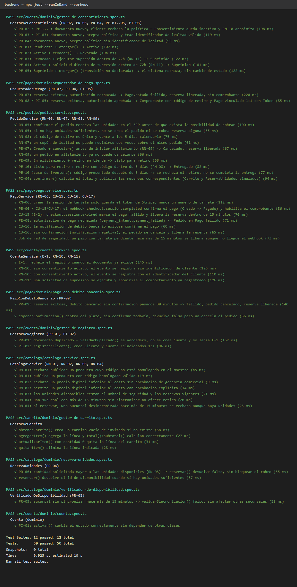
Observaciones: `backend/src/cuenta/dominio/gestor-de-registro.spec.ts`.

### CASO DE PRUEBA No. PR-02
**VERSIÓN DE EJECUCIÓN:** 1
**FECHA EJECUCIÓN:** 2026-09-17
**MÓDULO DEL SISTEMA:** 1.2 Cuenta Digital
**1. CASO DE PRUEBA**
a. Precondiciones: documento nuevo, sin cuenta previa.
b. Pasos de la prueba: `GestorDeRegistro.registrarCliente()` con documento nuevo; luego el cliente rechaza la política llamando `GestorDeConsentimiento.revocarConsentimiento()`; se registra un evento de comportamiento.
c. Poscondiciones: `Cuenta.estado = activa`; `Consentimiento.status = REVOCADO` (inactivo); el evento de comportamiento posterior se guarda sin `id_cliente` (RN-10).
**2. RESULTADOS DE LA PRUEBA**
Defectos y desviaciones: ninguno.
Veredicto: [x] Paso   [ ] Falló
Evidencia: 
Observaciones: `backend/src/cuenta/dominio/gestor-de-consentimiento.spec.ts`.

### CASO DE PRUEBA No. PR-03
**VERSIÓN DE EJECUCIÓN:** 1
**FECHA EJECUCIÓN:** 2026-09-17
**MÓDULO DEL SISTEMA:** 1.2 Cuenta Digital
**1. CASO DE PRUEBA**
a. Precondiciones: documento nuevo; trae un identificador de lealtad con formato válido y existente en el programa simulado (`LEALTAD-123456`).
b. Pasos de la prueba: `GestorDeConsentimiento.otorgarConsentimiento(customerId, "LEALTAD-123456")`, que internamente llama `IdentificadorLealtad.vincular()`.
c. Poscondiciones: `Consentimiento.status = ACTIVO`; se crea el `IdentificadorLealtad` y `Customer.loyaltyId` queda vinculado.
**2. RESULTADOS DE LA PRUEBA**
Defectos y desviaciones: ninguno.
Veredicto: [x] Paso   [ ] Falló
Evidencia: 
Observaciones: `backend/src/cuenta/dominio/gestor-de-consentimiento.spec.ts`. También cubre PI-03 (ver más abajo).

### CASO DE PRUEBA No. PR-04
**VERSIÓN DE EJECUCIÓN:** 1
**FECHA EJECUCIÓN:** 2026-09-17
**MÓDULO DEL SISTEMA:** 1.2 Cuenta Digital
**1. CASO DE PRUEBA**
a. Precondiciones: documento nuevo, acepta la política, no trae identificador de lealtad.
b. Pasos de la prueba: `GestorDeConsentimiento.otorgarConsentimiento(customerId)` sin `loyaltyId`.
c. Poscondiciones: `Consentimiento.status = ACTIVO`; `Customer.loyaltyId` permanece `null`, no se crea `IdentificadorLealtad`.
**2. RESULTADOS DE LA PRUEBA**
Defectos y desviaciones: ninguno.
Veredicto: [x] Paso   [ ] Falló
Evidencia: 
Observaciones: `backend/src/cuenta/dominio/gestor-de-consentimiento.spec.ts`.

### CASO DE PRUEBA No. PR-05
**VERSIÓN DE EJECUCIÓN:** 1
**FECHA EJECUCIÓN:** 2026-09-17
**MÓDULO DEL SISTEMA:** 1.4 Pedido
**1. CASO DE PRUEBA**
a. Precondiciones: dos sucursales con disponibilidad para el mismo producto; una sincronizada hace 20 minutos, otra recién sincronizada.
b. Pasos de la prueba: `VerificadorDeDisponibilidad.validarSincronizacion()` sobre cada sucursal.
c. Poscondiciones: devuelve `false` para la sucursal desincronizada (RN-04) y `true` para la otra — el retiro queda deshabilitado solo para esa sucursal, el resto del flujo sigue igual.
**2. RESULTADOS DE LA PRUEBA**
Defectos y desviaciones: ninguno.
Veredicto: [x] Paso   [ ] Falló
Evidencia: 
Observaciones: `backend/src/catalogo/dominio/verificador-de-disponibilidad.spec.ts`.

### CASO DE PRUEBA No. PR-06
**VERSIÓN DE EJECUCIÓN:** 1
**FECHA EJECUCIÓN:** 2026-09-17
**MÓDULO DEL SISTEMA:** 1.4 Pedido
**1. CASO DE PRUEBA**
a. Precondiciones: disponibilidad real de 15 unidades (RN-03: 20 erp − 5 umbral).
b. Pasos de la prueba: `ReservaUnidades.reservar(productId, branchId, 999)` — cantidad muy superior a la disponible.
c. Poscondiciones: `reservar()` devuelve `false` (no lanza excepción); no queda ninguna unidad reservada; el llamador puede notificar E-1 sin bloquear el cobro.
**2. RESULTADOS DE LA PRUEBA**
Defectos y desviaciones: ninguno.
Veredicto: [x] Paso   [ ] Falló
Evidencia: 
Observaciones: `backend/src/catalogo/dominio/reserva-unidades.spec.ts`.

### CASO DE PRUEBA No. PR-07
**VERSIÓN DE EJECUCIÓN:** 1
**FECHA EJECUCIÓN:** 2026-09-17
**MÓDULO DEL SISTEMA:** 1.5 Pago
**1. CASO DE PRUEBA**
a. Precondiciones: pedido confirmado con reserva de unidades exitosa (RN-05).
b. Pasos de la prueba: `OrquestadorDePago.procesarPago(customerId, orderId, "tarjeta", eventoSimulado)` con un evento `payment_intent.payment_failed` simulado (equivalente a la tarjeta de prueba de rechazo de Stripe).
c. Poscondiciones: `Pago.status = FAILED`; la reserva se libera (verificado de inmediato, dentro del límite de 15 minutos que exige el canon — el paso del tiempo se simula, nunca se espera de verdad); no se genera `Comprobante` (`GeneradorDeComprobante.generar()` lanza error).
**2. RESULTADOS DE LA PRUEBA**
Defectos y desviaciones: ninguno.
Veredicto: [x] Paso   [ ] Falló
Evidencia: 
Observaciones: `backend/src/pago/dominio/orquestador-de-pago.spec.ts`.

### CASO DE PRUEBA No. PR-08
**VERSIÓN DE EJECUCIÓN:** 1
**FECHA EJECUCIÓN:** 2026-09-17
**MÓDULO DEL SISTEMA:** 1.5 Pago
**1. CASO DE PRUEBA**
a. Precondiciones: pedido confirmado con reserva de unidades exitosa.
b. Pasos de la prueba: `OrquestadorDePago.procesarPago(customerId, orderId, "tarjeta", eventoSimulado)` con un evento `checkout.session.completed` simulado; luego `GeneradorDeComprobante.generar()`.
c. Poscondiciones: se crea `Comprobante` con código de retiro válido por 5 días calendario (RN-08); `Pago.status = CONFIRMED`; el pedido queda `PAID`, reflejando el descuento de inventario ya reservado en el ERP.
**2. RESULTADOS DE LA PRUEBA**
Defectos y desviaciones: ninguno.
Veredicto: [x] Paso   [ ] Falló
Evidencia: 
Observaciones: `backend/src/pago/dominio/orquestador-de-pago.spec.ts`. También cubre PI-05 (ver más abajo).

### CASO DE PRUEBA No. PR-09
**VERSIÓN DE EJECUCIÓN:** 1
**FECHA EJECUCIÓN:** 2026-09-17
**MÓDULO DEL SISTEMA:** 1.5 Pago
**1. CASO DE PRUEBA**
a. Precondiciones: pedido confirmado, pago con débito bancario iniciado (`PagoConDebitoBancario.procesar()`), sin confirmación.
b. Pasos de la prueba: se adelanta `Payment.createdAt` 31 minutos hacia atrás (simulando el paso del tiempo sin esperar de verdad) y se llama `PagoConDebitoBancario.esperarConfirmacion()`.
c. Poscondiciones: devuelve `false`; `Pago.status = FAILED`; el pedido queda `CANCELLED`; la reserva se libera.
**2. RESULTADOS DE LA PRUEBA**
Defectos y desviaciones: ninguno.
Veredicto: [x] Paso   [ ] Falló
Evidencia: 
Observaciones: `backend/src/pago/dominio/pago-con-debito-bancario.spec.ts`.

### CASO DE PRUEBA No. PR-10
**VERSIÓN DE EJECUCIÓN:** 1
**FECHA EJECUCIÓN:** 2026-09-22
**MÓDULO DEL SISTEMA:** 1.5 Pago
**1. CASO DE PRUEBA**
a. Precondiciones: pedido confirmado con reserva de unidades exitosa; intento de pago con débito bancario ya iniciado (`PagoConDebitoBancario.procesar()` / `PagoService.crearIntentoDebito()`), dentro del plazo de 30 minutos.
b. Pasos de la prueba: `PagoService.notificarDebito(orderId, true)` — equivalente a la notificación real de confirmación que entrega la pasarela de débito bancario simulada (CU-16, paso 2).
c. Poscondiciones: `Pago.status = CONFIRMED`; `Pedido.status = PAID`; el comprobante queda disponible para emitirse (CU-17), igual que en el camino de éxito con tarjeta (PR-08) pero por la ruta de débito bancario.
**2. RESULTADOS DE LA PRUEBA**
Defectos y desviaciones: ninguno. Esta ruta (débito bancario confirmado con éxito) es la única ruta independiente del diagrama de actividad del Caso de Uso 2 que no tenía ficha propia — el código y la prueba ya existían y ya pasaban desde la entrega del 2026-09-17 (`pago.service.spec.ts`, visible en la Figura 1 de este documento), como cobertura fuera del conteo formal de las 26. Se promueve aquí a ficha PR-10, sin escribir código nuevo, para completar las 10 pruebas de ruta.
Veredicto: [x] Paso   [ ] Falló
Evidencia:  — línea `✓ CU-16: la notificación de débito bancario exitosa confirma el pago`.
Observaciones: `backend/src/pago/pago.service.spec.ts`, `it("CU-16: la notificación de débito bancario exitosa confirma el pago")`.

---

## 9.2 Pruebas de unidad — prueba basada en estado

### CASO DE PRUEBA No. PE-01
**VERSIÓN DE EJECUCIÓN:** 1
**FECHA EJECUCIÓN:** 2026-09-17
**MÓDULO DEL SISTEMA:** 1.2 Cuenta Digital
**1. CASO DE PRUEBA**
a. Precondiciones: `Consentimiento` en estado Pendiente (recién registrado el cliente).
b. Pasos de la prueba: `GestorDeConsentimiento.otorgarConsentimiento(customerId)`.
c. Poscondiciones: `Consentimiento.status = ACTIVO`.
**2. RESULTADOS DE LA PRUEBA**
Defectos y desviaciones: ninguno.
Veredicto: [x] Paso   [ ] Falló
Evidencia: 
Observaciones: `backend/src/cuenta/dominio/gestor-de-consentimiento.spec.ts`.

### CASO DE PRUEBA No. PE-02
**VERSIÓN DE EJECUCIÓN:** 1
**FECHA EJECUCIÓN:** 2026-09-17
**MÓDULO DEL SISTEMA:** 1.2 Cuenta Digital
**1. CASO DE PRUEBA**
a. Precondiciones: `Consentimiento` en estado Activo.
b. Pasos de la prueba: `GestorDeConsentimiento.revocarConsentimiento(customerId)`.
c. Poscondiciones: `Consentimiento.status = REVOCADO`.
**2. RESULTADOS DE LA PRUEBA**
Defectos y desviaciones: ninguno.
Veredicto: [x] Paso   [ ] Falló
Evidencia: 
Observaciones: `backend/src/cuenta/dominio/gestor-de-consentimiento.spec.ts`.

### CASO DE PRUEBA No. PE-03
**VERSIÓN DE EJECUCIÓN:** 1
**FECHA EJECUCIÓN:** 2026-09-17
**MÓDULO DEL SISTEMA:** 1.2 Cuenta Digital
**1. CASO DE PRUEBA**
a. Precondiciones: `Consentimiento` en estado Revocado.
b. Pasos de la prueba: `GestorDeConsentimiento.solicitarSupresion(customerId)`, luego `ejecutarSupresionesPendientes()` dentro de las 72 horas (RN-11).
c. Poscondiciones: `Consentimiento.status = SUPRIMIDO`.
**2. RESULTADOS DE LA PRUEBA**
Defectos y desviaciones: ninguno.
Veredicto: [x] Paso   [ ] Falló
Evidencia: 
Observaciones: `backend/src/cuenta/dominio/gestor-de-consentimiento.spec.ts`.

### CASO DE PRUEBA No. PE-04
**VERSIÓN DE EJECUCIÓN:** 1
**FECHA EJECUCIÓN:** 2026-09-17
**MÓDULO DEL SISTEMA:** 1.2 Cuenta Digital
**1. CASO DE PRUEBA**
a. Precondiciones: `Consentimiento` en estado Activo.
b. Pasos de la prueba: solicitud directa de supresión (`solicitarSupresion` + `ejecutarSupresionesPendientes`) dentro de las 72 horas, sin pasar antes por Revocado.
c. Poscondiciones: `Consentimiento.status = SUPRIMIDO`.
**2. RESULTADOS DE LA PRUEBA**
Defectos y desviaciones: ninguno.
Veredicto: [x] Paso   [ ] Falló
Evidencia: 
Observaciones: `backend/src/cuenta/dominio/gestor-de-consentimiento.spec.ts`.

### CASO DE PRUEBA No. PE-05
**VERSIÓN DE EJECUCIÓN:** 1
**FECHA EJECUCIÓN:** 2026-09-17
**MÓDULO DEL SISTEMA:** 1.2 Cuenta Digital
**1. CASO DE PRUEBA**
a. Precondiciones: `Consentimiento` en estado Suprimido (terminal).
b. Pasos de la prueba: `GestorDeConsentimiento.otorgarConsentimiento(customerId)` — transición no declarada desde un estado terminal.
c. Poscondiciones: el sistema rechaza la operación (`ConflictException`, "No se puede otorgar ni revocar un consentimiento ya suprimido"); el estado permanece `SUPRIMIDO`, sin cambio.
**2. RESULTADOS DE LA PRUEBA**
Defectos y desviaciones: ninguno.
Veredicto: [x] Paso   [ ] Falló
Evidencia: 
Observaciones: `backend/src/cuenta/dominio/gestor-de-consentimiento.spec.ts`.

### CASO DE PRUEBA No. PE-06
**VERSIÓN DE EJECUCIÓN:** 1
**FECHA EJECUCIÓN:** 2026-09-17
**MÓDULO DEL SISTEMA:** 1.5 Pago
**1. CASO DE PRUEBA**
a. Precondiciones: `Pedido` en estado Creado, con sesión de tarjeta ya iniciada.
b. Pasos de la prueba: el webhook `checkout.session.completed` (real de Stripe en las pruebas de sistema; simulado en la prueba unitaria) llega a `PagoService.manejarEventoStripe()`.
c. Poscondiciones: `Pedido.status = PAID`.
**2. RESULTADOS DE LA PRUEBA**
Defectos y desviaciones: ninguno.
Veredicto: [x] Paso   [ ] Falló
Evidencia: 
Observaciones: `backend/src/pago/pago.service.spec.ts`.

### CASO DE PRUEBA No. PE-07
**VERSIÓN DE EJECUCIÓN:** 1
**FECHA EJECUCIÓN:** 2026-09-17
**MÓDULO DEL SISTEMA:** 1.4 Pedido
**1. CASO DE PRUEBA**
a. Precondiciones: `Pedido` en estado Creado, alistamiento no iniciado.
b. Pasos de la prueba: `PedidoService.cancelar(orderId)` (RN-09).
c. Poscondiciones: `Pedido.status = CANCELLED`; la reserva de unidades se libera.
**2. RESULTADOS DE LA PRUEBA**
Defectos y desviaciones: ninguno.
Veredicto: [x] Paso   [ ] Falló
Evidencia: 
Observaciones: `backend/src/pedido/pedido.service.spec.ts`. El mismo archivo agrega un caso complementario no listado en el plan original (un pedido ya en alistamiento no puede cancelarse), para blindar RN-09 en ambos sentidos.

### CASO DE PRUEBA No. PE-08
**VERSIÓN DE EJECUCIÓN:** 1
**FECHA EJECUCIÓN:** 2026-09-17
**MÓDULO DEL SISTEMA:** 1.5 Pago
**1. CASO DE PRUEBA**
a. Precondiciones: `Pedido` en estado Creado, con sesión de tarjeta iniciada.
b. Pasos de la prueba: evento `payment_intent.payment_failed` llega a `PagoService.manejarEventoStripe()`.
c. Poscondiciones: `Pedido.status = PAYMENT_FAILED` (Pago fallido).
**2. RESULTADOS DE LA PRUEBA**
Defectos y desviaciones: ninguno. Este camino ya existía implementado en `manejarEventoStripe()` pero no tenía prueba propia — se agregó.
Veredicto: [x] Paso   [ ] Falló
Evidencia: 
Observaciones: `backend/src/pago/pago.service.spec.ts`.

### CASO DE PRUEBA No. PE-09
**VERSIÓN DE EJECUCIÓN:** 1
**FECHA EJECUCIÓN:** 2026-09-17
**MÓDULO DEL SISTEMA:** 1.4 Pedido
**1. CASO DE PRUEBA**
a. Precondiciones: `Pedido` en estado En alistamiento (`PREPARING`).
b. Pasos de la prueba: `PedidoService.marcarListoParaRetiro(orderId)` (retiro en tienda).
c. Poscondiciones: `Pedido.status = READY_FOR_PICKUP` (Listo para retiro).
**2. RESULTADOS DE LA PRUEBA**
Defectos y desviaciones: ninguno.
Veredicto: [x] Paso   [ ] Falló
Evidencia: 
Observaciones: `backend/src/pedido/pedido.service.spec.ts`.

### CASO DE PRUEBA No. PE-10
**VERSIÓN DE EJECUCIÓN:** 1
**FECHA EJECUCIÓN:** 2026-09-17
**MÓDULO DEL SISTEMA:** 1.4 Pedido
**1. CASO DE PRUEBA**
a. Precondiciones: `Pedido` en estado Listo para retiro, con código de retiro vigente.
b. Pasos de la prueba: (i) `PedidoService.retirarConCodigo(orderId, pickupCode, ahora)` con `ahora` dentro de los 5 días; (ii) caso de frontera: mismo llamado con `ahora` un día después del vencimiento (RN-08).
c. Poscondiciones: (i) `Pedido.status = DELIVERED` (Entregado); (ii) se rechaza con error ("El código de retiro venció"), el pedido permanece `READY_FOR_PICKUP`, sin completar la entrega.
**2. RESULTADOS DE LA PRUEBA**
Defectos y desviaciones: ninguno.
Veredicto: [x] Paso   [ ] Falló
Evidencia: 
Observaciones: `backend/src/pedido/pedido.service.spec.ts` (dos `it(...)` separados: caso normal y caso de frontera).

---

## 9.3 Pruebas de integración

### CASO DE PRUEBA No. PI-01
**VERSIÓN DE EJECUCIÓN:** 1
**FECHA EJECUCIÓN:** 2026-09-17
**MÓDULO DEL SISTEMA:** 1.2 Cuenta Digital
**1. CASO DE PRUEBA**
a. Precondiciones: ninguna — `Cuenta` es el módulo atómico de la primera capa, sin dependencias.
b. Pasos de la prueba: `new Cuenta()` y `activar()`, sin `TestingModule` ni Prisma.
c. Poscondiciones: `Cuenta.estado` pasa de `"pendiente"` a `"activa"` correctamente, sin necesitar ninguna otra clase.
**2. RESULTADOS DE LA PRUEBA**
Defectos y desviaciones: ninguno.
Veredicto: [x] Paso   [ ] Falló
Evidencia: 
Observaciones: `backend/src/cuenta/dominio/cuenta.spec.ts`.

### CASO DE PRUEBA No. PI-02
**VERSIÓN DE EJECUCIÓN:** 1
**FECHA EJECUCIÓN:** 2026-09-17
**MÓDULO DEL SISTEMA:** 1.2 Cuenta Digital
**1. CASO DE PRUEBA**
a. Precondiciones: grupo 2 (Cliente + Cuenta), sin manejador de prueba — se invoca directo, sin pasar por la pantalla de registro.
b. Pasos de la prueba: `GestorDeRegistro.registrarCliente(dto)`.
c. Poscondiciones: se crean un `Cliente` y una `Cuenta` relacionados 1:1 (mismo `id`).
**2. RESULTADOS DE LA PRUEBA**
Defectos y desviaciones: ninguno.
Veredicto: [x] Paso   [ ] Falló
Evidencia: 
Observaciones: `backend/src/cuenta/dominio/gestor-de-registro.spec.ts`.

### CASO DE PRUEBA No. PI-03
**VERSIÓN DE EJECUCIÓN:** 1
**FECHA EJECUCIÓN:** 2026-09-17
**MÓDULO DEL SISTEMA:** 1.2 Cuenta Digital
**1. CASO DE PRUEBA**
a. Precondiciones: grupo 3 (Cliente + Consentimiento), con `PoliticaDatos` simulada (versión vigente fija `POLITICA_DATOS_VIGENTE`).
b. Pasos de la prueba: `GestorDeConsentimiento.otorgarConsentimiento()`.
c. Poscondiciones: el `Consentimiento` creado referencia correctamente `politicaDatosVersion` igual a la versión simulada.
**2. RESULTADOS DE LA PRUEBA**
Defectos y desviaciones: ninguno.
Veredicto: [x] Paso   [ ] Falló
Evidencia: 
Observaciones: `backend/src/cuenta/dominio/gestor-de-consentimiento.spec.ts`.

### CASO DE PRUEBA No. PI-04
**VERSIÓN DE EJECUCIÓN:** 1
**FECHA EJECUCIÓN:** 2026-09-17
**MÓDULO DEL SISTEMA:** 1.4 Pedido
**1. CASO DE PRUEBA**
a. Precondiciones: grupo 4 (Pedido), con `CarritoService` y `CatalogoService` (que sostiene a `ReservaUnidades`) sustituidos por dobles de prueba (`useValue`) que devuelven datos fijos.
b. Pasos de la prueba: `PedidoService.confirmar(customerId, dto)`.
c. Poscondiciones: se calcula el total correctamente (`15000 × 2 = 30000`) y se solicita la reserva con los parámetros correctos (`reservarUnidades` llamado con `productId`, `branchId`, `quantity` esperados).
**2. RESULTADOS DE LA PRUEBA**
Defectos y desviaciones: ninguno.
Veredicto: [x] Paso   [ ] Falló
Evidencia: 
Observaciones: `backend/src/pedido/pedido.service.spec.ts`.

### CASO DE PRUEBA No. PI-05
**VERSIÓN DE EJECUCIÓN:** 1
**FECHA EJECUCIÓN:** 2026-09-17
**MÓDULO DEL SISTEMA:** 1.5 Pago
**1. CASO DE PRUEBA**
a. Precondiciones: grupo 5 (final) — Pedido + Pago, con `Token` (gatewayToken) y la pasarela (`AdaptadorStripe`) simulados con una autorización fija.
b. Pasos de la prueba: `OrquestadorDePago.procesarPago()` con evento simulado `checkout.session.completed`.
c. Poscondiciones: se crea un `Pago` (`CONFIRMED`) vinculado 1:1 con su `Token` (`payments.order_id` único); `Pedido.status` se actualiza a `PAID`; ningún manejador de prueba de los grupos 1 a 4 queda sin retirar en este grupo final (cada `TestingModule` de este grupo usa exclusivamente clases reales salvo `AdaptadorStripe`).
**2. RESULTADOS DE LA PRUEBA**
Defectos y desviaciones: ninguno.
Veredicto: [x] Paso   [ ] Falló
Evidencia: 
Observaciones: `backend/src/pago/dominio/orquestador-de-pago.spec.ts`.

---

## 9.4 Pruebas del sistema (caja negra, end-to-end)

### CASO DE PRUEBA No. CU-04-01
**VERSIÓN DE EJECUCIÓN:** 1
**FECHA EJECUCIÓN:** 2026-09-22
**MÓDULO DEL SISTEMA:** 1.2 Cuenta Digital
**1. CASO DE PRUEBA**
a. Precondiciones: ninguna — documento, correo y contraseña nuevos, generados con un sufijo único por corrida; sin cuenta previa.
b. Pasos de la prueba, caja negra contra la aplicación real (frontend + backend + Postgres reales, sin Stripe de por medio):
   1. El cliente completa el formulario de registro en `/registro` (P-4: nombre, documento, correo, contraseña) y confirma "Crear cuenta" → el sistema crea `Cliente`/`Cuenta` y un `Consentimiento` en estado Pendiente (CU-04).
   2. El sistema redirige a `/privacidad` (P-5); el interruptor de consentimiento aparece apagado (`aria-pressed="false"`), sin la insignia "Consentimiento activo".
   3. El cliente activa el interruptor, sin identificador de lealtad → el sistema otorga el consentimiento (CU-05, un solo clic, canon sección 10: activar en ≤ 2 interacciones).
c. Poscondiciones: la insignia "Consentimiento activo" queda visible y `aria-pressed="true"`; `GET /cuenta/consentimiento` (caja negra, API pública con el token de sesión real) responde `active: true`.
**2. RESULTADOS DE LA PRUEBA**
Defectos y desviaciones: ninguno.
Veredicto: [x] Paso   [ ] Falló
Evidencia:
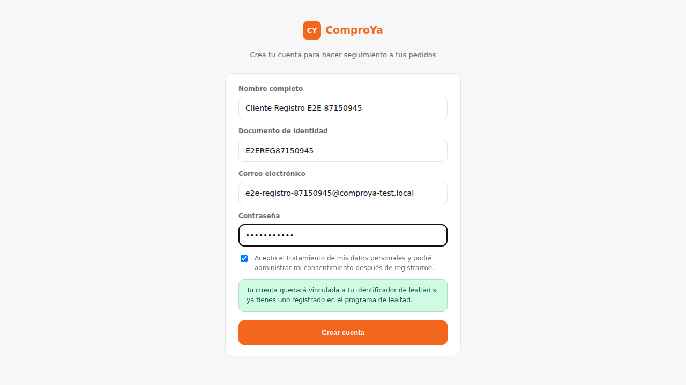
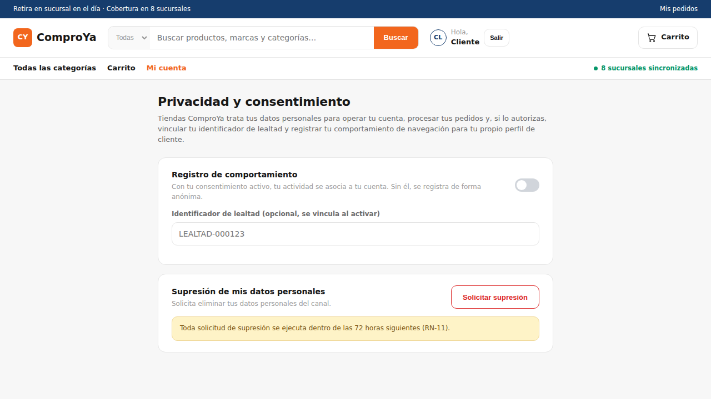
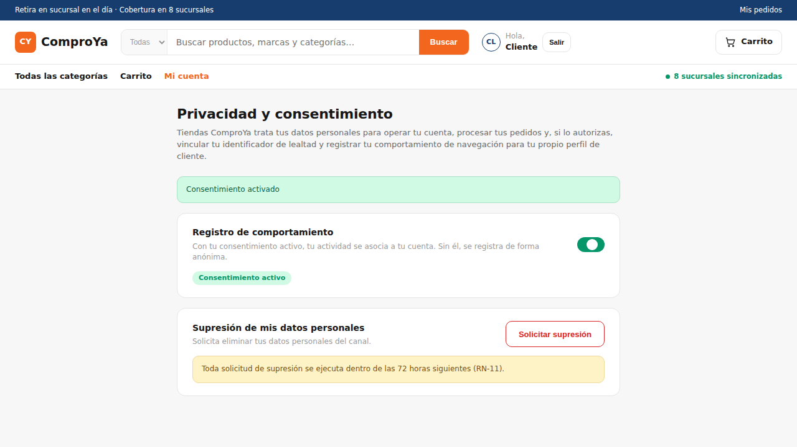
Observaciones: `e2e/tests/cu-04-01-registro-consentimiento.spec.ts`, ejecutado contra el frontend/backend reales. Cierra la brecha de que el Caso de Uso 1 no tenía ninguna prueba de sistema propia (CU-09-01/CU-09-02 son ambas del Caso de Uso 2).

### CASO DE PRUEBA No. CU-09-01
**VERSIÓN DE EJECUCIÓN:** 1
**FECHA EJECUCIÓN:** 2026-09-17
**MÓDULO DEL SISTEMA:** 1.4 Pedido / 1.5 Pago
**1. CASO DE PRUEBA**
a. Precondiciones: el Cliente digital tiene sesión activa (registrado por API, con consentimiento activo), un carrito con un producto homologado y publicado (Televisor LED 55'' 4K UHD, catálogo curado), y la sucursal de retiro sincronizada con el ERP hace menos de 15 minutos (RN-04, sincronizada explícitamente antes de la prueba).
b. Pasos de la prueba, tal como los definió el plan de pruebas:
   1. El cliente confirma el pedido desde la pantalla de resumen (`/pedido/confirmar`) → el sistema reserva las unidades en el ERP (RN-03) y bloquea el cobro hasta que la reserva quede confirmada (RN-05).
   2. El cliente ingresa los datos de la tarjeta en la pantalla de Stripe Checkout real (`4242 4242 4242 4242`, sandbox) y confirma → el sistema no almacena los datos de la tarjeta; recibe un token de la pasarela (RN-06) y solicita la autorización.
   3. La pasarela responde con autorización aprobada (webhook real `checkout.session.completed`, reenviado por `stripe listen`) → el sistema genera el Comprobante con un código de retiro válido por 5 días calendario (RN-08) y lo muestra en `/comprobante/:orderId`.
c. Poscondiciones: el pedido queda en estado Pagado; el comprobante queda consultable con su código de retiro (`RET-...`); las unidades reservadas permanecen descontadas en el ERP.
**2. RESULTADOS DE LA PRUEBA**
Defectos y desviaciones: ninguno.
Veredicto: [x] Paso   [ ] Falló
Evidencia:

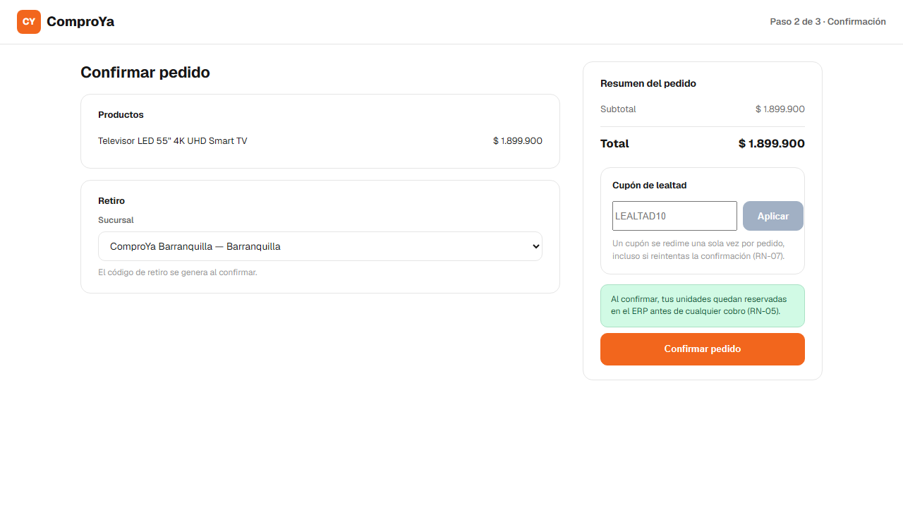
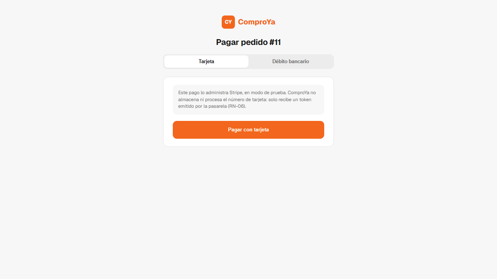
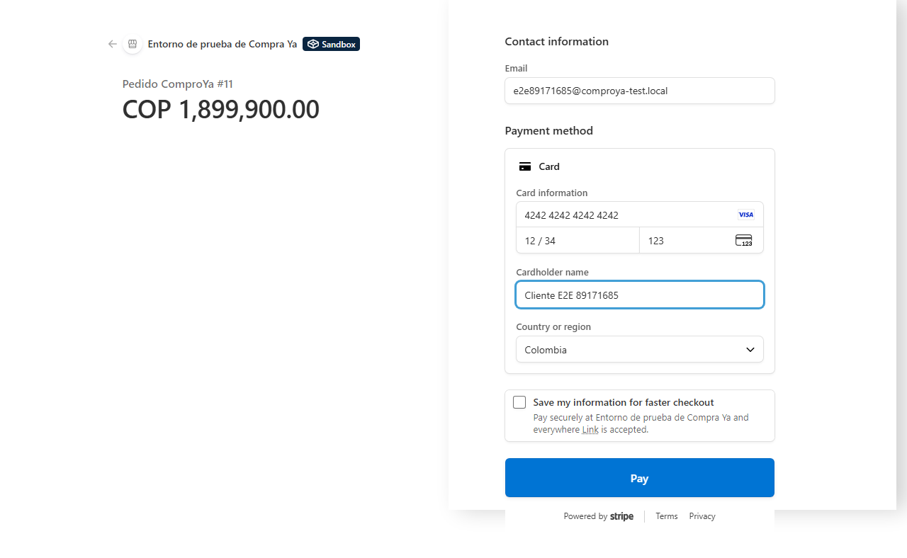
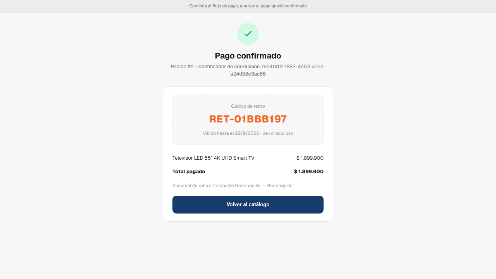
Observaciones: `e2e/tests/cu-09-01-camino-exito.spec.ts`, ejecutado contra el frontend/backend reales y Stripe en modo de prueba real (no simulado). Ver `e2e/README.md` para el orden de arranque (backend, frontend, `stripe listen`).

### CASO DE PRUEBA No. CU-09-02
**VERSIÓN DE EJECUCIÓN:** 1
**FECHA EJECUCIÓN:** 2026-09-17
**MÓDULO DEL SISTEMA:** 1.4 Pedido / 1.5 Pago
**1. CASO DE PRUEBA**
a. Precondiciones: el Cliente digital tiene un carrito confirmado y una reserva de unidades ya creada en el ERP para ese pedido (Licuadora, catálogo curado).
b. Pasos de la prueba:
   1. El cliente ingresa los datos de la tarjeta de prueba de rechazo de Stripe (`4000 0000 0000 0002`) y confirma el pago → el sistema tokeniza el medio de pago y solicita la autorización a la pasarela.
   2. La pasarela responde con autorización rechazada — visible en la misma pantalla de Stripe Checkout ("Your credit card was declined. Try paying with a debit card instead.").
   3. (Ver nota metodológica en la sección de desviaciones y en `e2e/README.md`.) Se expira la misma Checkout Session con la API real de Stripe, lo que dispara el webhook real `checkout.session.expired` → el sistema marca el Pago como fallido y libera la reserva de unidades.
c. Poscondiciones: el pedido no queda pagado (`PAYMENT_FAILED`, "Pago fallido" visible en `/pedidos`); no se emite comprobante (`GET /pagos/:orderId/comprobante` responde error); las unidades reservadas vuelven a estar disponibles.
**2. RESULTADOS DE LA PRUEBA**
Defectos y desviaciones: ninguno más allá de la desviación metodológica ya documentada (expiración de sesión vía API real de Stripe en vez de esperar 30 minutos reales).
Veredicto: [x] Paso   [ ] Falló
Evidencia:
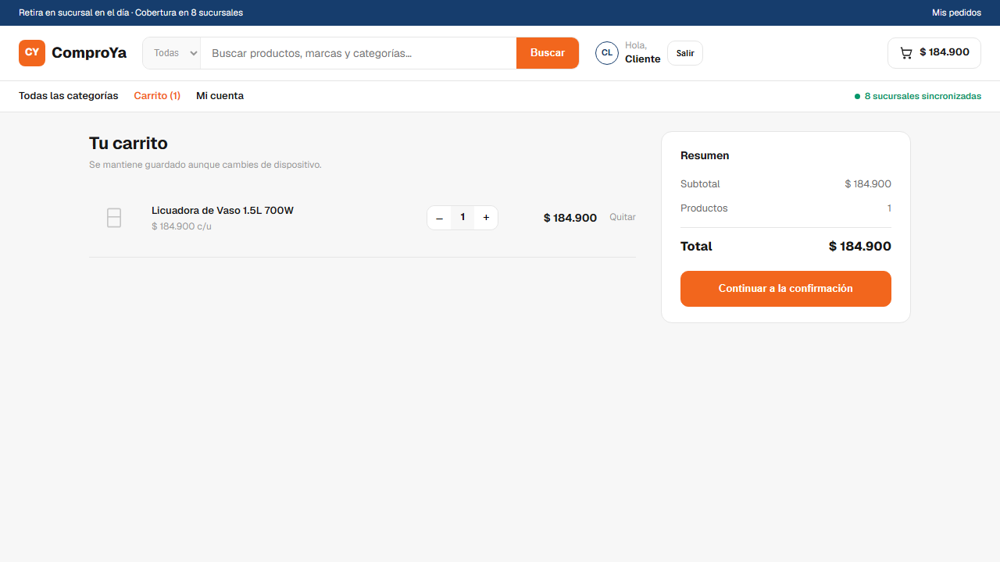
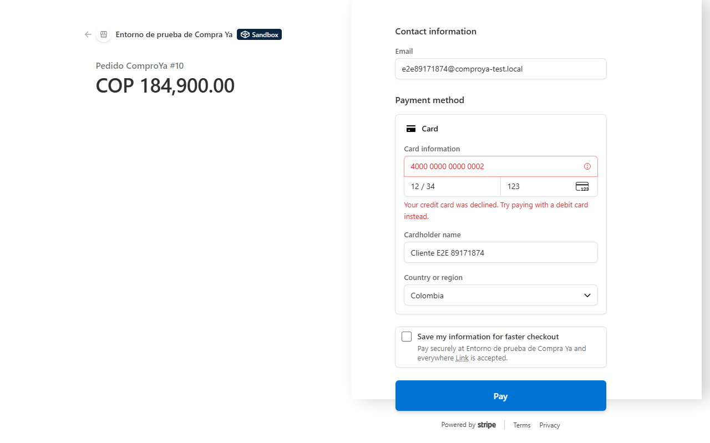
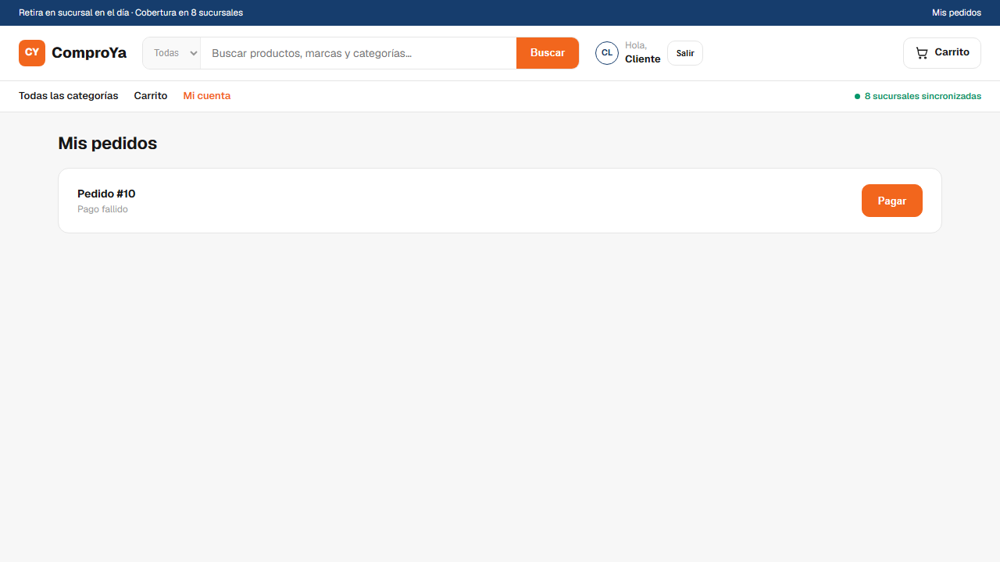
Observaciones: `e2e/tests/cu-09-02-camino-fallo.spec.ts`. La reserva liberada y la ausencia de comprobante se verificaron también contra la API real (no solo visualmente).

---

## Tabla resumen

| ID | Veredicto | Archivo de prueba | Commit/rama |
|---|---|---|---|
| PR-01 | Pasó | `cuenta/dominio/gestor-de-registro.spec.ts` | `feature/cu1-cu2-registro-consentimiento-compra` |
| PR-02 | Pasó | `cuenta/dominio/gestor-de-consentimiento.spec.ts` | `feature/cu1-cu2-registro-consentimiento-compra` |
| PR-03 | Pasó | `cuenta/dominio/gestor-de-consentimiento.spec.ts` | `feature/cu1-cu2-registro-consentimiento-compra` |
| PR-04 | Pasó | `cuenta/dominio/gestor-de-consentimiento.spec.ts` | `feature/cu1-cu2-registro-consentimiento-compra` |
| PR-05 | Pasó | `catalogo/dominio/verificador-de-disponibilidad.spec.ts` | `feature/cu1-cu2-registro-consentimiento-compra` |
| PR-06 | Pasó | `catalogo/dominio/reserva-unidades.spec.ts` | `feature/cu1-cu2-registro-consentimiento-compra` |
| PR-07 | Pasó | `pago/dominio/orquestador-de-pago.spec.ts` | `feature/cu1-cu2-registro-consentimiento-compra` |
| PR-08 | Pasó | `pago/dominio/orquestador-de-pago.spec.ts` | `feature/cu1-cu2-registro-consentimiento-compra` |
| PR-09 | Pasó | `pago/dominio/pago-con-debito-bancario.spec.ts` | `feature/cu1-cu2-registro-consentimiento-compra` |
| PR-10 | Pasó | `pago/pago.service.spec.ts` | `claude/admiring-pascal-hgg7i9` |
| PE-01 | Pasó | `cuenta/dominio/gestor-de-consentimiento.spec.ts` | `feature/cu1-cu2-registro-consentimiento-compra` |
| PE-02 | Pasó | `cuenta/dominio/gestor-de-consentimiento.spec.ts` | `feature/cu1-cu2-registro-consentimiento-compra` |
| PE-03 | Pasó | `cuenta/dominio/gestor-de-consentimiento.spec.ts` | `feature/cu1-cu2-registro-consentimiento-compra` |
| PE-04 | Pasó | `cuenta/dominio/gestor-de-consentimiento.spec.ts` | `feature/cu1-cu2-registro-consentimiento-compra` |
| PE-05 | Pasó | `cuenta/dominio/gestor-de-consentimiento.spec.ts` | `feature/cu1-cu2-registro-consentimiento-compra` |
| PE-06 | Pasó | `pago/pago.service.spec.ts` | `feature/cu1-cu2-registro-consentimiento-compra` |
| PE-07 | Pasó | `pedido/pedido.service.spec.ts` | `feature/cu1-cu2-registro-consentimiento-compra` |
| PE-08 | Pasó | `pago/pago.service.spec.ts` | `feature/cu1-cu2-registro-consentimiento-compra` |
| PE-09 | Pasó | `pedido/pedido.service.spec.ts` | `feature/cu1-cu2-registro-consentimiento-compra` |
| PE-10 | Pasó | `pedido/pedido.service.spec.ts` | `feature/cu1-cu2-registro-consentimiento-compra` |
| PI-01 | Pasó | `cuenta/dominio/cuenta.spec.ts` | `feature/cu1-cu2-registro-consentimiento-compra` |
| PI-02 | Pasó | `cuenta/dominio/gestor-de-registro.spec.ts` | `feature/cu1-cu2-registro-consentimiento-compra` |
| PI-03 | Pasó | `cuenta/dominio/gestor-de-consentimiento.spec.ts` | `feature/cu1-cu2-registro-consentimiento-compra` |
| PI-04 | Pasó | `pedido/pedido.service.spec.ts` | `feature/cu1-cu2-registro-consentimiento-compra` |
| PI-05 | Pasó | `pago/dominio/orquestador-de-pago.spec.ts` | `feature/cu1-cu2-registro-consentimiento-compra` |
| CU-04-01 | Pasó | `e2e/tests/cu-04-01-registro-consentimiento.spec.ts` | `claude/admiring-pascal-hgg7i9` |
| CU-09-01 | Pasó | `e2e/tests/cu-09-01-camino-exito.spec.ts` | `feature/cu1-cu2-registro-consentimiento-compra` |
| CU-09-02 | Pasó | `e2e/tests/cu-09-02-camino-fallo.spec.ts` | `feature/cu1-cu2-registro-consentimiento-compra` |

**28 de 28 casos pasaron**, todos en su primera ejecución real (sin necesidad de una segunda versión de ejecución). El backend completo (50 pruebas Jest en 12 archivos, que incluyen los 24 casos de unidad/integración más las pruebas ya existentes de sprints anteriores) también pasa sin regresiones — reconfirmado el 2026-09-22 (ver evidencia/unitarias-integracion-01.png).

## Cobertura extra, fuera de las 26 (no reportada como caso de prueba formal)

Se agregó `backend/src/carrito/dominio/gestor-de-carrito.spec.ts` (4 pruebas) porque `carrito.service.ts` no tenía ninguna prueba propia antes de esta entrega, y `GestorDeCarrito` (control exigido por el documento UML) lo envuelve directamente.
