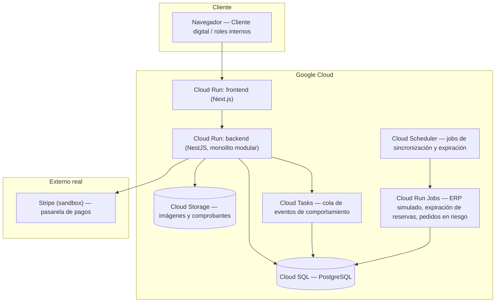

# Arquitectura técnica — ComproYa en Línea

Este documento traduce el canon del proyecto (`docs/canon/CANON-ComproYa.md`) en decisiones de arquitectura de software: qué se construye, con qué tecnología, cómo se despliega y por qué. No es un entregable académico de la asignatura — es la base técnica que Claude Code va a usar para ejecutar el desarrollo real del canal digital. Los identificadores SP-XX (sub-problema), C-XX (característica), CU-XX (caso de uso) y RN-XX (regla de negocio) que aparecen aquí están definidos en el canon; no se repiten sus tablas completas, solo se referencian donde justifican una decisión.

## 1. Punto de partida: qué obliga el canon a construir

El canal cubre ocho sub-problemas (SP-01 a SP-08): gobierno del catálogo, disponibilidad, carrito, cierre de la venta, cobro y conciliación, ejecución del pedido, identidad del comprador, y consentimiento con registro de comportamiento. Cada uno tiene umbrales de tiempo concretos en la sección 10 del canon — por ejemplo, la búsqueda debe responder en P95 ≤ 1,5 s con hasta 40.000 productos publicados, y un evento de comportamiento debe quedar publicado en ≤ 2 s con pérdida ≤ 0,1 %. Esos números, no una noción abstracta de "rápido" o "escalable" (prohibida en el vocabulario del canon), son los que dimensionan la arquitectura.

También importa la escala real de tráfico: el pico documentado es de 900 pedidos por hora, es decir, 0,25 pedidos por segundo en el peor momento. Esa cifra es baja para cualquier arquitectura moderna en la nube — el diseño no necesita resolver un problema de escala masiva, necesita resolver correctitud transaccional (reservas de unidades, RN-03 y RN-05) y trazabilidad (RN-04, conciliación diaria con diferencia ≤ 0,1 %).

## 2. Estilo arquitectónico: monolito modular, no microservicios

Con dos personas en el equipo y doce semanas de desarrollo (seis sprints de dos semanas, sección 9 del canon), microservicios reales introducen un costo que el proyecto no puede pagar: cada servicio necesita su propio pipeline de despliegue, su propio contrato de interfaz versionado, y sobre todo, transacciones distribuidas para algo que el canon exige que sea atómico — RN-05 dice que ningún pedido se cobra sin que las unidades queden reservadas en el ERP, y RN-03 calcula disponibilidad restando reservas en tiempo real. Repartir catálogo, carrito, pedido e inventario en servicios distintos convierte esa atomicidad en un problema de coordinación entre servicios, exactamente lo que hoy ya falla en la plataforma contratada que se está reemplazando.

La alternativa que se adopta es un **monolito modular**: un solo backend desplegado, pero con los ocho sub-problemas del canon como módulos internos con límites de código explícitos (carpetas separadas, sin importar entidades de otro módulo directamente, solo a través de un servicio de aplicación). Esto da lo que sí vale la pena de microservicios — separación de responsabilidades, posibilidad de extraer un módulo a servicio propio más adelante si el tráfico real lo exige — sin pagar el costo operativo ahora. Cloud Run, además, escala cada revisión del monolito de forma horizontal igual que si fueran varios servicios, así que no se pierde elasticidad por no dividir el despliegue.

La siguiente tabla resume la decisión frente a las alternativas consideradas.

| Alternativa | Por qué se descarta / adopta |
|---|---|
| Microservicios por sub-problema (8 servicios) | Transacciones distribuidas para RN-03/RN-05, 8 pipelines de CI/CD, y ningún requisito de escala que lo justifique (0,25 pedidos/s pico) |
| Monolito sin módulos internos | Cumple el despliegue simple, pero mezcla las ocho responsabilidades y hace difícil evolucionar un sub-problema sin tocar los demás |
| **Monolito modular (adoptado)** | Un despliegue, una base de datos transaccional, módulos con límites de código alineados 1:1 con SP-01..SP-08 — evoluciona a servicios separados solo si el tráfico real lo exige |

## 3. Módulos del backend

Cada módulo del backend corresponde a un sub-problema del canon, y dentro de cada módulo viven los casos de uso que ese sub-problema resuelve. Esta correspondencia es la misma que ya usa la EDT del canon (sección 8), así que un cambio de alcance en el canon se traduce directamente en un cambio de módulo aquí, sin reinterpretación.

| Módulo (backend) | Sub-problema | Casos de uso que contiene | Sprint del canon |
|---|---|---|---|
| `catalogo` | SP-01, SP-02 | CU-01, CU-02, CU-03 | 1 |
| `cuenta` | SP-07, SP-08 | CU-04, CU-05, CU-06 | 2 |
| `carrito` | SP-03 | CU-07, CU-08 | 3 |
| `pedido` | SP-04 | CU-09, CU-10 | 4 |
| `pago` | SP-05 | CU-15, CU-16, CU-17 | 5 |
| `operacion` (alistamiento y entrega) | SP-06 | CU-11, CU-12, CU-13, CU-14 | 6 |

## 4. Stack tecnológico

Se mantiene TypeScript de punta a punta (backend, frontend y scripts de infraestructura) porque es el lenguaje principal del equipo y reduce el costo de cambiar de contexto entre capas.

| Componente | Tecnología | Por qué |
|---|---|---|
| Backend | Node.js 22 + NestJS (TypeScript) | NestJS fuerza la separación en módulos de la sección 3 (cada `SP-XX` es literalmente un `NestModule`), tiene inyección de dependencias para poder sustituir los adaptadores de sistemas externos (sección 6) sin tocar la lógica de negocio |
| Frontend cliente | Next.js (TypeScript, App Router) | Server-side rendering para el catálogo (SEO y el umbral de búsqueda P95 ≤ 1,5 s se benefician de no depender solo de fetch en cliente), y una sola base de código para las pantallas del Cliente digital |
| Panel interno | Mismo proyecto Next.js, rutas separadas | Coordinador de Canal Digital, Gerente de Tienda y Analista de Marketing son pocos usuarios internos — no justifica una segunda aplicación |
| Base de datos | PostgreSQL (Cloud SQL) vía Prisma | Ver sección 5 — es la pieza que responde la duda de si hace falta storage |
| Almacenamiento de archivos | Cloud Storage | Solo para imágenes de producto y comprobantes en PDF, no para datos transaccionales |
| Pagos | Stripe (modo sandbox) | Ya definido en conversaciones anteriores; cumple RN-06 porque el canal nunca toca el número de tarjeta, solo recibe un token de Stripe |
| Autenticación | Passport + JWT propio dentro de `cuenta` | Ver sección 7 |

## 5. Persistencia: sí hace falta una base de datos real

La duda planteada era si, sembrando el catálogo con datos externos (ver `backend/prisma/README.md`), se podía evitar tener una base de datos propia. La respuesta es no, y la razón está en el canon, no en preferencia técnica: el catálogo es la única parte del sistema que es mayormente de lectura. Todo lo demás es estado que cambia con cada interacción y que tiene que sobrevivir entre peticiones — el carrito debe persistir y fusionarse entre dispositivo con una diferencia ≤ 30 s (C-04), una reserva de unidades tiene que existir de forma verificable antes de cobrar (RN-05), un pedido tiene una máquina de estados completa (creado, pagado, en alistamiento, listo para retiro o despachado, entregado, cancelado, pago fallido), y la conciliación diaria pedido–pago–inventario exige que esos tres registros cuadren con una diferencia ≤ 0,1 %. Nada de eso es simulable con datos estáticos.

Por eso la siembra de catálogo (el proyecto `comproya-seed` ya construido, ahora en `backend/prisma/`) resuelve solo el problema de tener datos de partida realistas para el módulo `catalogo` — no reemplaza la necesidad de Cloud SQL como base de datos transaccional para carrito, pedido, pago y disponibilidad. Cloud Storage, en cambio, sí es opcional en los primeros sprints: mientras el catálogo use las URLs de imagen de DummyJSON, no hace falta bucket propio; se vuelve necesario cuando se quiera controlar esas imágenes o generar comprobantes en PDF (C-09).

## 6. Sistemas externos: fuera de alcance, pero simulados

El canon declara seis sistemas como "fuera pero condicionantes": el canal los consume, no los gobierna (sección 3). Como este es un proyecto académico, ninguno de esos sistemas existe de verdad — hay que simularlos con adaptadores propios, de modo que el día que existan de verdad, solo se reemplaza el adaptador y no la lógica de negocio que depende de él. Esto es exactamente el patrón de puertos y adaptadores: cada módulo del backend depende de una interfaz (`PuertoErp`, `PuertoPasarelaDePagos`, etc.), y hay una implementación simulada de cada una.

| Sistema externo (canon, sección 3) | Adaptador simulado | Cómo se simula |
|---|---|---|
| ERP centralizado | `AdaptadorErpSimulado` | Un job programado actualiza directamente `existenciasErp` y `sincronizadoEn` en la tabla `Disponibilidad` (el mismo modelo que ya sembró `backend/prisma/seed.ts`), imitando el proceso por lotes nocturno real, pero exponiendo esa marca de tiempo cada ≤ 5 minutos en vez de cada noche (cumple el umbral de disponibilidad del canon) |
| Maestro de códigos homologados | Parte de `AdaptadorErpSimulado` | El código homologado, la categoría y el costo se generan en la siembra de catálogo (`backend/prisma/seed.ts`) |
| Programa de lealtad | `AdaptadorLealtadSimulado` | Tabla `cupones_lealtad` con cupones de prueba vigentes, para poder ejercitar RN-07 (redención única) |
| Pasarela de pagos | Stripe (sandbox) | No se simula — Stripe ya resuelve esto de verdad en modo de pruebas, incluyendo RN-06 |
| Operador logístico externo | `AdaptadorLogisticaSimulado` | Genera un número de guía aleatorio y un estado de entrega ficticio, solo para que CU-11 (consulta de estado) tenga algo que mostrar |
| Plataforma contratada actual | No aplica | Es el sistema que se reemplaza, no uno que el canal consuma |

## 7. Autenticación y cuentas

El canon deja explícito (decisión D-01) que el primer sprint **no incluye autenticación** — CU-01, CU-02 y CU-03 son de catálogo público. La cuenta del Cliente digital aparece recién en el sprint 2 con CU-04. Por eso el módulo `cuenta` implementa un registro y login propios (JWT, contraseña con hash) en vez de delegar en un proveedor externo tipo Firebase Auth: el registro de cuenta tiene que quedar vinculado al identificador de lealtad (C-14), que es lógica de negocio del canal, no un detalle de autenticación que convenga tercerizar.

## 8. Procesamiento asíncrono y trabajos programados

Varias reglas del canon tienen un plazo que no puede depender de que alguien mantenga abierta una pestaña del navegador: una reserva se libera si el pago con tarjeta falla en ≤ 15 minutos, un pedido con pago por débito bancario se cancela solo si no hay confirmación en 30 minutos, y un pedido pasa a "en riesgo" a las 4 horas hábiles sin avanzar (C-13). Esto se resuelve con Cloud Scheduler disparando Cloud Run Jobs periódicos, no con lógica dentro de la petición HTTP que originó el pedido.

| Regla / característica | Plazo (canon, sección 10) | Mecanismo |
|---|---|---|
| RN-04 — sucursal desincronizada | > 15 min sin sync deshabilita retiro | Cloud Scheduler cada 5 min recalcula `sincronizadoEn` por sucursal |
| Pago con tarjeta fallido | Reserva liberada ≤ 15 min | Cloud Run Job cada 5 min revisa reservas de pedidos con pago fallido |
| Pago con débito bancario | Cancelación a los 30 min sin confirmar | Mismo job, umbral distinto |
| C-13 — pedido en riesgo | 4 horas hábiles sin avanzar | Cloud Scheduler cada 30 min, respetando horario hábil |
| C-16 — registro de comportamiento | Publicación ≤ 2 s, pérdida ≤ 0,1 % | Cola (Cloud Tasks) entre la petición del cliente y la escritura en base de datos, para no bloquear la respuesta HTTP con el registro del evento |
| RN-11 — supresión de datos personales | ≤ 72 horas | Cloud Run Job diario procesa solicitudes de supresión pendientes |

## 9. Diagrama de despliegue

## 10. Trazabilidad: umbral del canon → mecanismo técnico

La sección 10 del canon fija veinte umbrales de requisitos. La tabla siguiente no los repite todos (están en `docs/canon/CANON-ComproYa.md`), pero deja explícito, para los más exigentes de cumplir, qué pieza de esta arquitectura los sostiene — que es lo que permitiría, en una sustentación, explicar de dónde sale cada número.

| Umbral (canon) | Mecanismo técnico |
|---|---|
| Búsqueda P95 ≤ 1,5 s con 40.000 productos | Índice `GIN`/`pg_trgm` sobre `productos.nombre` en Postgres; si en pruebas de carga no alcanza, siguiente paso es Cloud Memorystore (caché) antes de considerar un motor de búsqueda aparte |
| Disponibilidad con retraso ≤ 5 min frente al ERP | Job de sincronización cada 5 min (sección 8), no cada noche como hoy |
| Confirmación de pedido P95 ≤ 3 s, picos de 900/hora | Trivial para Cloud Run en autoescalado — 900/hora son 0,25 solicitudes/s |
| Pago con tarjeta confirmado ≤ 60 s | Latencia propia de la interfaz de Stripe, muy por debajo del umbral |
| Conciliación pedido–pago–inventario, diferencia ≤ 0,1 % | Reserva de unidades y registro de pago viven en la misma base de datos transaccional (Postgres), dentro de la misma transacción SQL — no hay ventana de inconsistencia entre sistemas distintos |

## 11. Decisiones que hay que revisar

- Se asumió Stripe en modo sandbox y Postgres en Cloud SQL porque ya se habían acordado en esta conversación; si el equipo prefiere otro motor de base de datos, cambia la sección 5 y el `schema.prisma`, no el resto del documento.
- Se asumió que el panel interno (Coordinador de Canal Digital, Gerente de Tienda, Analista de Marketing) vive en el mismo proyecto Next.js que el sitio del Cliente digital, separado por rutas y por rol autenticado — si prefieren una aplicación aparte, es un cambio de la sección 4, no de la 3.
- La cola de eventos de comportamiento (Cloud Tasks) es la pieza más "de más" para un proyecto académico — se puede simplificar a una escritura directa asíncrona (`fire and forget`) en los primeros sprints y añadir Cloud Tasks solo si la demo de carga lo necesita.
